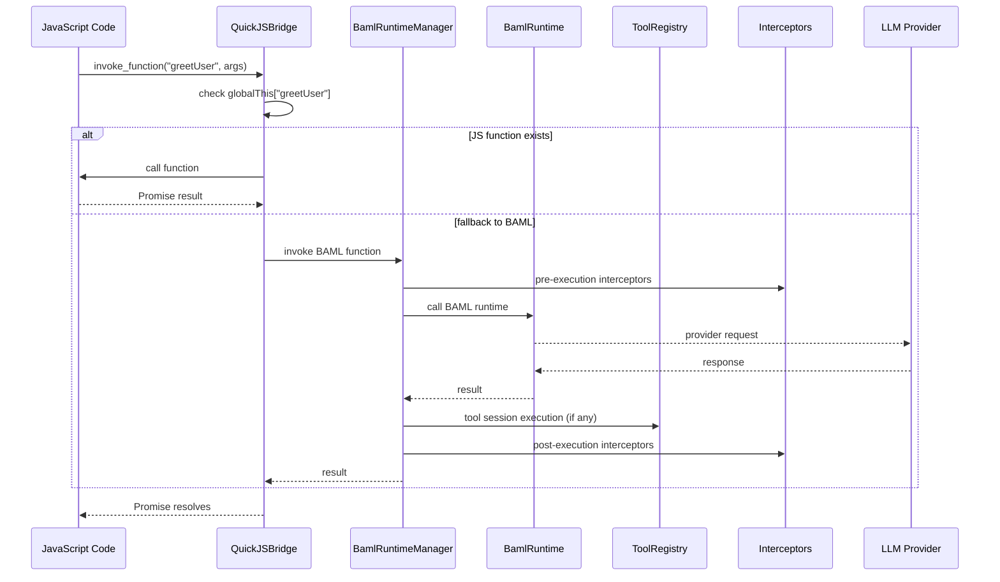
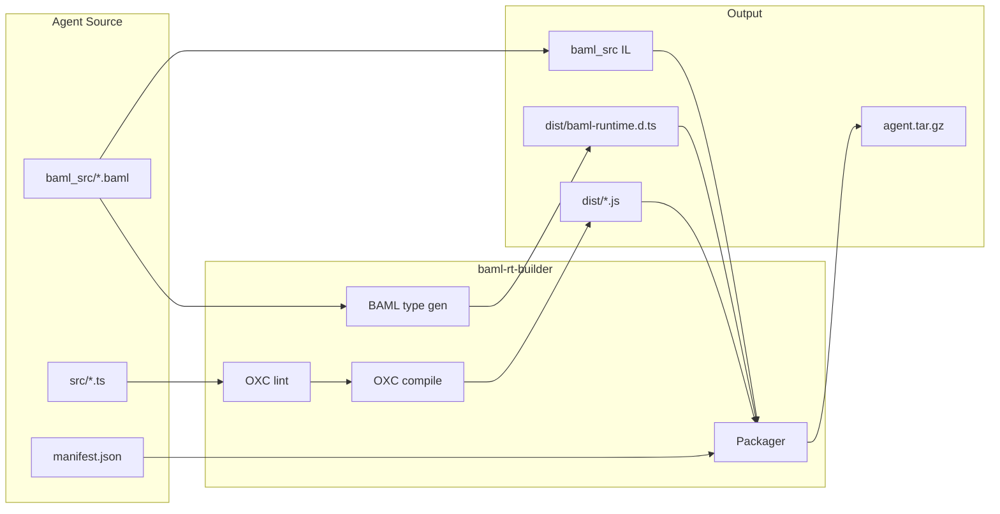

# BAML Runtime

BAML Runtime is a Rust workspace that hosts BAML execution, QuickJS agent
integration, tool systems, and A2A protocol handling. The public entry point is
the `baml-rt` facade crate, which re-exports feature-gated subcrates.

## Workspace Architecture

### Crate Map (Bottom-Up)

- `baml-rt-core`: Core errors/results, correlation helpers, and shared types.
- `baml-rt-tools`: Tool traits, registry/executor, and session FSM primitives.
- `baml-rt-interceptor`: Interceptor traits, pipelines, and tracing interceptors.
- `baml-rt-observability`: Tracing setup, spans, and metrics helpers.
- `baml-rt-quickjs`: QuickJS runtime host, schema loading, JS bridge, and context.
- `baml-rt-a2a`: Agent-to-agent protocol types, transport, and request handling.
- `baml-rt-builder`: Agent build pipeline and `baml-agent-builder` CLI.
- `baml-agent-runner`: Binary that loads packaged agents and serves A2A requests.
- `baml-rt`: Facade crate that re-exports the above via feature flags.
- `test-support`: Shared fixtures and helper utilities for tests.

### Runtime Flow (QuickJS + BAML)



### Build + Packaging Flow



## Facade Features (`baml-rt`)

The `baml-rt` crate exposes feature-gated modules:

- `tools` → `baml-rt-tools`
- `interceptor` → `baml-rt-interceptor`
- `quickjs` → `baml-rt-quickjs` (implies tools/interceptor/observability)
- `a2a` → `baml-rt-a2a` (depends on `quickjs`)
- `builder` → `baml-rt-builder`
- `observability` → `baml-rt-observability`

Default features enable all of the above.

## BAML ↔ Host Tool Contract

Host tools are **session-based**. BAML returns a declarative `ToolSessionPlan`
that describes FSM steps (`Open`, `Send`, `Next`, `Finish`, `Abort`), and the
runtime executes those steps **in Rust**. JavaScript never mediates host tool
execution; JS only handles JS tools via `invokeTool`.

## Binaries

- `baml-agent-builder` (from `baml-rt-builder`): Lint, compile, and package agents.
- `baml-agent-runner` (from `baml-agent-runner`): Load packaged agents and serve A2A.

## Repository Layout

```text
baml-rt/
├── crates/
├── baml_src/        # Example BAML schemas
├── examples/        # Example agent packages
└── tests/           # Workspace-level tests and fixtures
```

## Testing

```bash
cargo test

# With output
cargo test -- --nocapture
```

## License

[License information]
